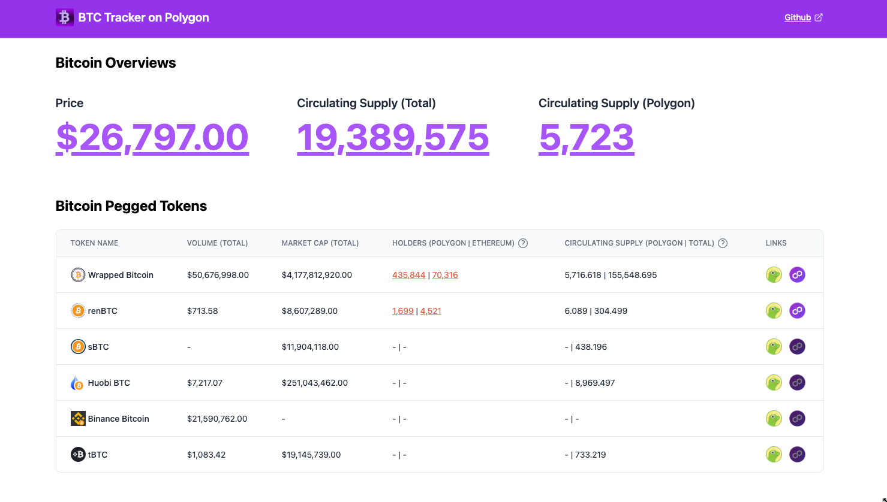
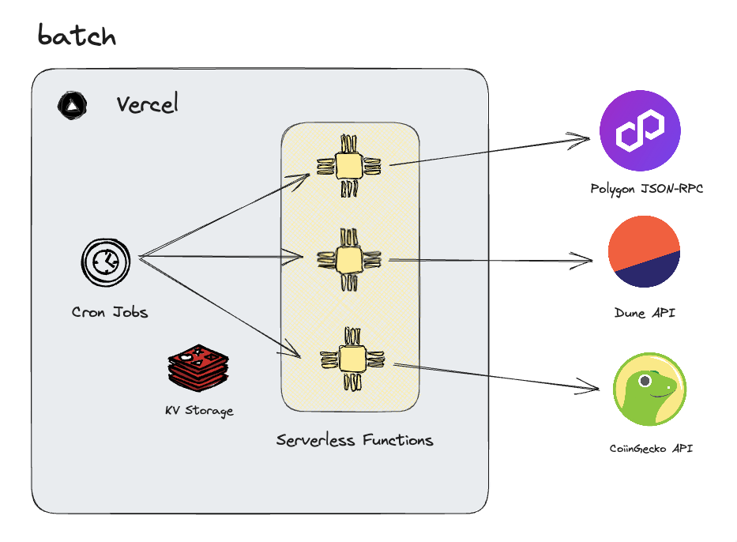

# Polygon BTC Tracker

<br>

This is a simple app that tracks the metrics of BTCs on Polygon.<br>
There are many types of Bridged BTC, and you can see their status through basic metrics.


## Demonstrations

### Live Demo

https://polygon-btc-tracker-web.vercel.app/

### Demo Video

TODO: paste url

## Architecture

<br>

### Used Technologies
* Vercel
  * Vercel KV Storage
  * Vercel Cron Jobs

## Data Sources

|  Metrics  |  Data Source  | Description |
| ---- | ---- | ---- |
|  Volume |  CoinGecko API  |  Utilizing the [CoinGecko Public API](https://www.coingecko.com/en/api).  |
|  Market Cap |  CoinGecko API |  Utilizing the [CoinGecko Public API](https://www.coingecko.com/en/api).  |
|  Holders |  Dune API |  [The Dune Query](https://dune.com/queries/2492386) has been created to obtain the number of BTC holders, which is invoked using [the Dune API](https://dune.com/docs/api/).  |
|  Circulating Supply |  Polygon (Ethereum) JSON-RPC API |  The `totalSupply` function is called from the JSON-RPC API to retrieve the current value.  |

## Development

### Requirements

* node　18.x
* pnpm 8.x
* [turborepo cli](https://turbo.build/repo/docs/installing#install-globally)
* [Vercel Pro or Hobby Plan](https://vercel.com/pricing)

### Setup

#### Installation
```bash
# duplicate the .env.sample file and edit the .env file.
$cp apps/web/.env.sample apps/web/.env

# install dependencies
$pnpm install
```

#### Creating Vercel KV

* You need to create a Vercel KV (Key-Value) and copy the environment variables related to the KV into your `.env` file.
* ref. [Vercel KV Quickstart](https://vercel.com/docs/storage/vercel-kv/quickstart#quickstart)


### Run

```bash
# run dev server
$turbo run dev

$open http://localhost:3000
```

## Production Deployment
### Requirements

* [Vercel Pro Plan](https://vercel.com/pricing)
*  You will need the Vercel Pro Plan because this app requires the use of more than three Vercel Cron Jobs.

## Useful Links

* [Turborepo](https://turbo.build/repo)
* [Coingecko API](https://www.coingecko.com/en/api)
* [Dune API](https://dune.com/docs/api/)
* [Vercel Storage](https://vercel.com/docs/storage)
* [Vercel Cron](https://vercel.com/docs/cron-jobs)

## License

This app is open-source and licensed under the MIT license. For more details, check the [License file](LICENSE).
